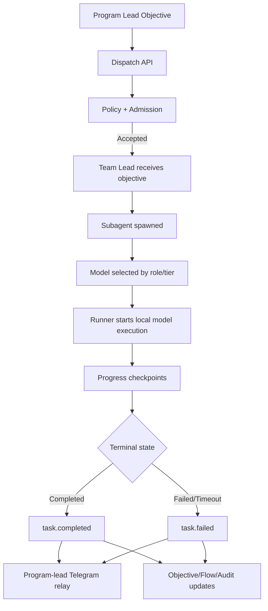
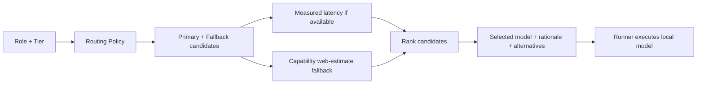
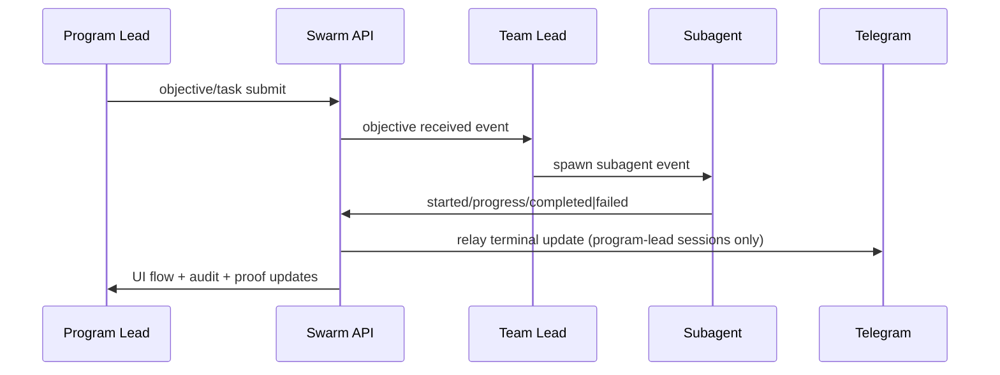

# Architecture

Last updated: 2026-03-15

## System Architecture

The platform is a local-first orchestration and observability system centered on OpenClaw + Ollama, with event-driven state and a multi-page operator UI.

## Component Map

1. Command and Control API
- Node/Express service in `src/server.js`.
- Exposes orchestration, control, flow, objective, ops, and audit endpoints.
- Enforces admin-auth for mutable endpoints.

2. Orchestration and policy
- Role inference and dispatch gating via policy/admission layers.
- Queue manager controls overflow and deferred starts.

3. Runner layer
- `src/openclawRunner.js` executes selected model locally via `ollama run` in real mode.
- Emits task lifecycle and progress events.

4. Event and state storage
- JSONL event stream (`data/events.jsonl`) with task/session mapping.
- Store aggregates objective board, task flow, chats, leaderboard, and Telegram proof.

5. Communication channels
- Telegram relay for program-lead updates.
- Internal team communication via `team.chat` and subagent lifecycle events.

6. Runtime telemetry
- GPU and process signals from `nvidia-smi`, `ollama ps`, and process table fallback.

7. UI surfaces
- Command center (global view)
- Timeline (objective and task progression)
- Audit (event trace)
- Ops (runtime and queue diagnostics)
- Leaderboard (scoring and throughput)

## Event Flow

## Model Assignment Architecture

## Communication Architecture

## Security Architecture

1. Protected writes
- `POST /api/orchestrator/dispatch`
- `POST /api/orchestrator/autonomous-run`
- `POST /api/control/team`
- `POST /api/control/reconcile`
- `POST /api/events`

2. API key handling
- Backend validates `x-api-key` when `ADMIN_API_KEY` is configured.
- UI stores unlock key in session storage; key is never rendered in a visible field.

## Resilience and Recovery

1. Runner timeout emits terminal event to avoid orphan running tasks.
2. Stale-task reconciliation repairs historical blocked queue/running artifacts.
3. Queue aging and periodic cleanup reduce long-lived backlog artifacts.

## Observability Surfaces and Source-of-Truth

1. Objective and flow: derived from event stream + task session map.
2. Runtime telemetry: sampled from system commands and runtime process introspection.
3. Telegram proof: event-backed record containing delivery id/message id/reason.
4. Audit trail: normalized event projection with source and human-readable detail.
