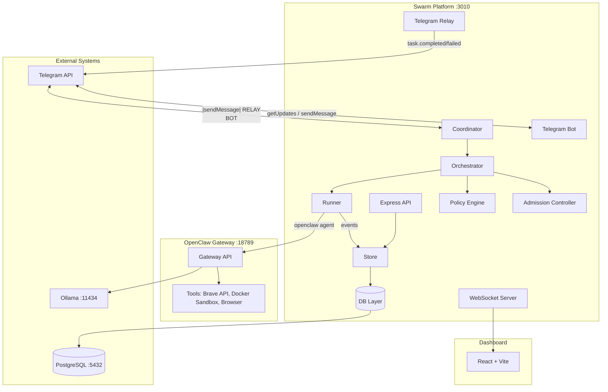
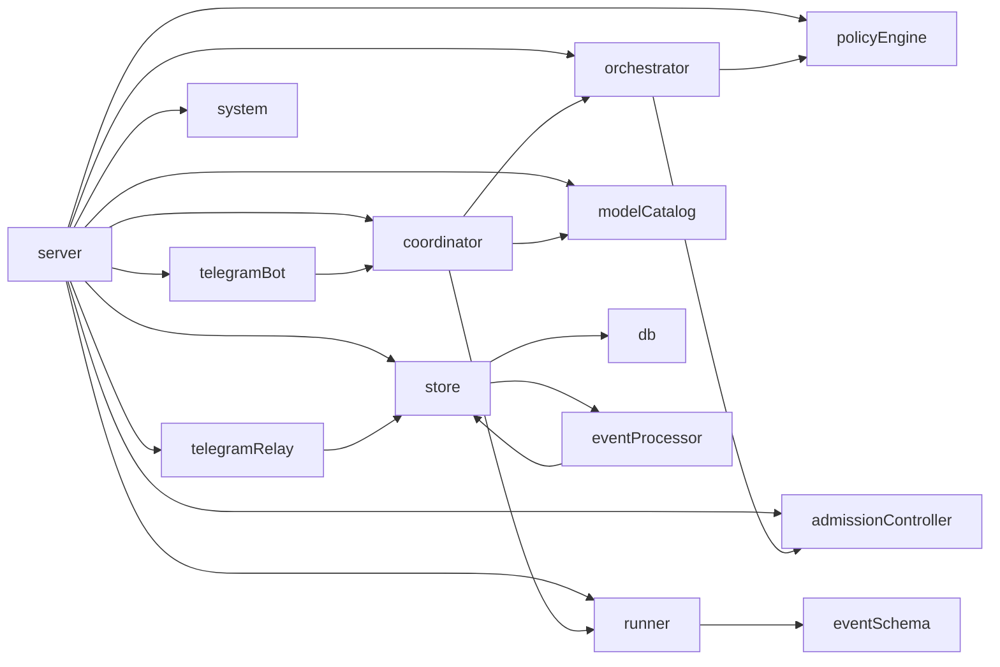
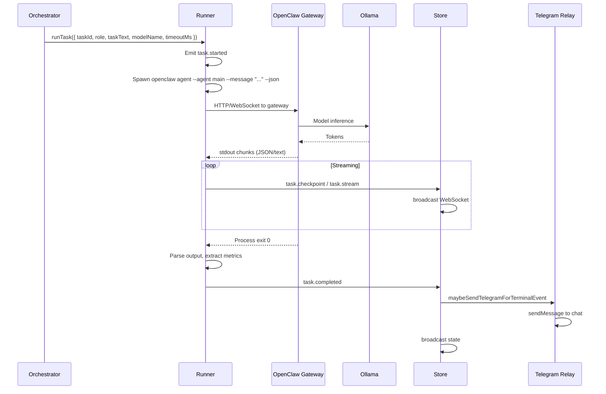
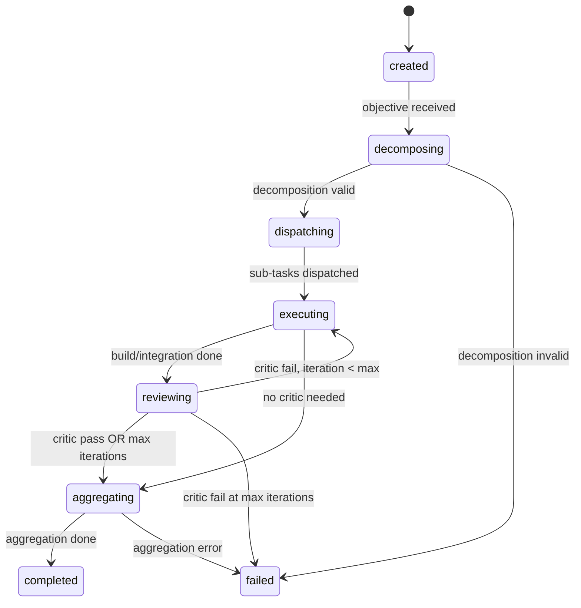
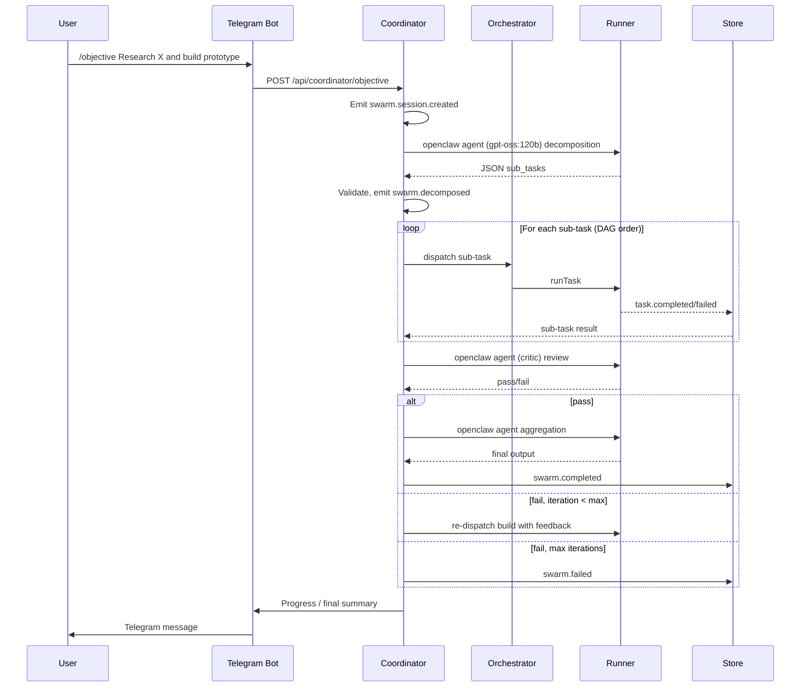
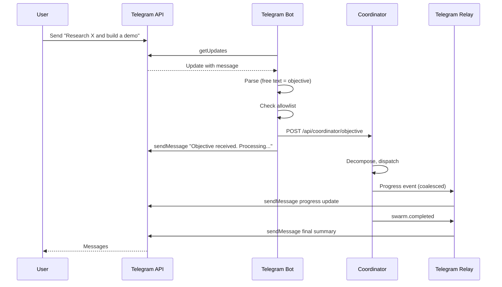
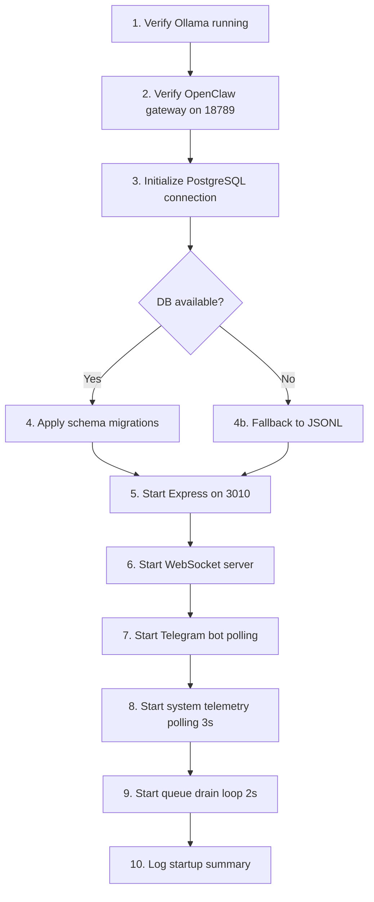

# OpenClaw Swarm Platform — Technical Specification

**Version:** 1.0  
**Last Updated:** 2026-03-15  
**Status:** Draft  
**Anchored to:** [PRD.md](./PRD.md)

---

## 1. System Overview

### 1.1 Architecture Diagram



### 1.2 Component Inventory Table

| Component | File(s) | Responsibility | Dependencies |
|-----------|---------|----------------|--------------|
| **Server** | `src/server.js` | HTTP API, WebSocket, polling loop, dispatch orchestration | Express, ws, Store, EventProcessor |
| **Runner** | `src/openclawRunner.js` | Spawns `openclaw agent` CLI, captures output, emits task events | child_process, eventSchema |
| **Coordinator** | `src/coordinator.js` (new) | Objective decomposition, sub-task DAG, critic loop, aggregation | Runner, PolicyEngine, modelCatalog |
| **Orchestrator** | `src/orchestrator.js` | Role inference, dispatch with policy/admission gating | PolicyEngine, AdmissionController |
| **Policy Engine** | `src/policyEngine.js` | Role inference, team validation, parallel limits | policies.json, teams.json |
| **Admission Controller** | `src/admissionController.js` | GPU-based load states, accept/queue/reject decisions | system.js |
| **Telegram Relay** | `src/telegramRelay.js` | Outbound sendMessage with retry | Bot API |
| **Telegram Bot** | `src/telegramBot.js` (new) | Inbound polling, command parsing, objective forwarding | getUpdates, Coordinator API |
| **Store** | `src/store.js` | Event persistence, aggregation, task flow, leaderboard | JSONL, DB |
| **DB** | `src/db.js` | PostgreSQL pool, schema operations | pg |
| **Event Schema** | `src/eventSchema.js` | Event validation, normalization | — |
| **Event Processor** | `src/eventProcessor.js` | Event side-effects, score snapshots | Store, DB |
| **Model Catalog** | `src/modelCatalog.js` | Model discovery, role routing, fallback selection | model_routing.json, ollama |
| **System** | `src/system.js` | GPU telemetry via nvidia-smi, load classification | nvidia-smi |

### 1.3 Dependency Graph



### 1.4 Port Assignments

| Port | Service | Description |
|------|---------|-------------|
| **3010** | Swarm Platform API | Express HTTP + WebSocket; primary entry for dashboard and API clients |
| **18789** | OpenClaw Gateway | Agent execution with tools (web search, sandbox, browser) |
| **11434** | Ollama | Local LLM inference; OpenClaw gateway connects to this |
| **5432** | PostgreSQL | Primary event store; optional fallback to JSONL |

### 1.5 Process Model

| Process | Description | Startup |
|---------|-------------|---------|
| **Swarm Platform** | Single Node.js process (`node src/server.js`). Hosts API, WebSocket, coordinator, runner, store, Telegram relay and bot. | `npm start` or `npm run dev` |
| **OpenClaw Gateway** | Separate process; must be running before swarm dispatches. Listens on 18789. | External (user-managed) |
| **Ollama** | System service or user process. Listens on 11434. | External (user-managed) |
| **PostgreSQL** | Database server. May run as Docker container or system service. | External (user-managed) |

---

## 2. Environment & Prerequisites

### 2.1 Required Environment Variables

| Name | Required | Default | Description |
|------|----------|---------|-------------|
| `PORT` | No | `3010` | Swarm API listen port |
| `DATABASE_URL` | No | `""` | PostgreSQL connection string; empty = JSONL fallback |
| `RUNNER_MODE` | No | `real` | `real` or `mock`; mock skips actual agent execution |
| `RUNNER_TIMEOUT_MS` | No | `120000` | Default task timeout (ms); overridden per-role by policies.json |
| `TELEGRAM_BOT_TOKEN` | No | from openclaw.json | Bot token for sendMessage and getUpdates |
| `TELEGRAM_DEFAULT_CHAT_ID` | No | `8679892510` | Default chat for outbound notifications |
| `TELEGRAM_ALLOWLIST` | No | `8679892510` | Comma-separated chat IDs allowed to send commands |
| `OPENCLAW_GATEWAY_URL` | No | `http://127.0.0.1:18789` | Base URL for OpenClaw gateway |
| `OLLAMA_HOST` | No | `127.0.0.1:11434` | Ollama API host:port |
| `MAX_ACTIVE_AGENTS` | No | `8` | Global max concurrent agents (NFR-SCALE-1) |
| `SYSTEM_POLL_MS` | No | `3000` | Interval for GPU telemetry and queue processing |
| `GPU_MEM_ELEVATED_PCT` | No | `60` | GPU memory % threshold for elevated load |
| `GPU_MEM_WARN_PCT` | No | `75` | GPU memory % threshold for high load |
| `GPU_MEM_EMERGENCY_PCT` | No | `85` | GPU memory % threshold for emergency |
| `GPU_MEM_CRIT_PCT` | No | `90` | GPU memory % threshold for critical (reject) |
| `ADMIN_API_KEY` | No | unset | When set, write endpoints require `x-api-key` header |
| `EVENT_RETENTION` | No | `5000` | Max in-memory events (NFR-DATA-1) |
| `BRAVE_API_KEY` | No | from openclaw.json | Brave API key for web search; not exposed to UI |

### 2.2 OpenClaw Config Contract

Config path: `~/.openclaw/openclaw.json`

| Path | Purpose | Used By |
|------|---------|---------|
| `channels.telegram.botToken` | Bot token fallback when `TELEGRAM_BOT_TOKEN` unset | Server, TelegramRelay, TelegramBot |
| `channels.telegram.enabled` | Whether Telegram channel is enabled | API /api/openclaw |
| `tools.web.search.enabled` | Web search tool enabled | API /api/openclaw |
| `tools.web.search.provider` | Search provider (e.g., brave) | API /api/openclaw |
| `tools.web.search.apiKey` | Brave API key fallback | OpenClaw gateway (not swarm) |
| `agents.defaults.sandbox.mode` | Sandbox mode (e.g., non-main) | API /api/openclaw |
| `agents.defaults.sandbox.scope` | Sandbox scope | API /api/openclaw |

### 2.3 Ollama Model Inventory Requirement

All 13 models MUST be pulled for full role routing. Implements FR-RUN-1, US-M3.

| Model | Size | Role(s) | Tier |
|-------|------|---------|------|
| `gpt-oss:120b` | 65GB | coordinator (program-lead), integrator fallback | quality |
| `qwen2.5:14b` | 9GB | critic fallback, integrator fallback | standard/quality |
| `gemma2:9b` | 5.4GB | — | standard |
| `deepseek-r1:8b` | 5.2GB | integrator primary, coordinator fallback | quality |
| `llama3.1:8b` | 4.9GB | critic primary | standard |
| `qwen2.5:7b` | 4.7GB | research primary, build fallback | fast/standard |
| `qwen2.5-coder:7b` | 4.7GB | build primary | standard |
| `mistral:7b` | 4.4GB | critic fallback | standard |
| `deepseek-coder:6.7b` | 3.8GB | build fallback | standard |
| `nemotron-mini:4b` | 2.7GB | — | fast |
| `phi3:mini` | 2.2GB | research fallback | fast |
| `llama3.2:3b` | 2GB | research fallback | fast |
| `qwen2.5:3b` | 1.9GB | — | fast |

### 2.4 PostgreSQL Schema Baseline

**Existing tables** (from `db/schema.sql`):

- `events` — id, ts, type, team_id, source, payload (JSONB)
- `score_snapshots` — ts, team_id, score, accuracy, completed, failed, penalties
- `audit_logs` — id, ts, actor, action, resource, payload (JSONB)
- `telegram_deliveries` — id, ts, team_id, task_id, event_id, chat_id, status, response (JSONB)

**New tables** (to add via migrations):

```sql
-- Swarm sessions: one per objective lifecycle
CREATE TABLE IF NOT EXISTS swarm_sessions (
  id TEXT PRIMARY KEY,
  ts TIMESTAMPTZ NOT NULL,
  team_id TEXT NOT NULL,
  objective TEXT NOT NULL,
  status TEXT NOT NULL,  -- created, decomposing, dispatching, executing, reviewing, aggregating, completed, failed
  decomposition JSONB,
  sub_task_ids TEXT[],
  final_output TEXT,
  error TEXT,
  updated_at TIMESTAMPTZ NOT NULL
);

CREATE INDEX IF NOT EXISTS swarm_sessions_team_ts_idx ON swarm_sessions(team_id, ts DESC);
CREATE INDEX IF NOT EXISTS swarm_sessions_status_idx ON swarm_sessions(status) WHERE status NOT IN ('completed', 'failed');
```

### 2.5 Docker Requirements

| Container | Purpose |
|-----------|---------|
| **PostgreSQL 16** | Primary event store when `DATABASE_URL` is set |
| **python:3.11-bookworm** | OpenClaw sandbox image for agent execution (bridge network) |

### 2.6 System Dependencies

| Dependency | Version / Notes |
|-------------|-----------------|
| **Node.js** | 18+ (ESM, `node:child_process`, `node:crypto`) |
| **npm packages** | express, pg, ws (see package.json) |
| **ollama** | CLI in PATH; `ollama list`, `ollama ps` for discovery |
| **openclaw** | CLI in PATH; `openclaw agent` for execution |
| **nvidia-smi** | For GPU telemetry (memory, utilization) |

---

## 3. Runner (openclawRunner.js)

Implements FR-RUN-1 through FR-RUN-6, US-R1 through US-R4.

### 3.1 `openclaw agent` CLI Invocation Contract

**Command template:**

```bash
openclaw agent --agent <agent> --message "<prompt>" --json
```

**Parameters:**

| Param | Value | Source |
|-------|--------|--------|
| `--agent` | `main` (default) or session-specific | Runner config; main = unsandboxed, non-main = sandboxed |
| `--message` | Full task prompt including role and context | `taskText` + optional prior outputs |
| `--json` | Required | Ensures JSON output for parsing |

**Environment variables passed to child process:**

| Variable | Value |
|----------|-------|
| `OPENCLAW_GATEWAY_URL` | From config (e.g., `http://127.0.0.1:18789`) |
| `OLLAMA_HOST` | From config (e.g., `127.0.0.1:11434`) |
| `PATH` | Inherited from parent |
| All other `process.env` | Inherited |

**Working directory:** Process current working directory (typically swarm platform root).

**stdio handling:**

- `stdin`: `ignore`
- `stdout`: `pipe` — JSON lines and streaming text; parsed for `result.payloads`
- `stderr`: `pipe` — captured for error diagnostics

### 3.2 JSON Output Schema

```typescript
interface OpenClawAgentOutput {
  result?: {
    payloads?: Array<
      | { type: "text"; text: string }
      | { type: "tool_calls"; tool_calls: ToolCall[] }
      | { type: "reasoning"; content: string }
    >;
  };
}

interface ToolCall {
  name: string;  // web_search, exec, browser_*, etc.
  args?: Record<string, unknown>;
}
```

**Metrics extraction** (from real output; replaces hardcoded scores per US-M3):

| Metric | Derivation |
|--------|------------|
| `correctness` | Heuristic: presence of structured output, tool success; or default 0.85 if unavailable |
| `speed` | `1 - (durationMs / timeoutMs)` clamped to [0, 1]; faster = higher |
| `efficiency` | Token/output ratio if available; else 0.75 default |
| `firstPass` | `true` if no critic iterations; else from session |
| `reproducible` | Not derivable from single run; default `true` |
| `resourcePenalty` | From GPU memory delta if tracked; else 0 |

**Tool usage tracking:** Count `tool_calls` in payloads by `name` (web_search, exec, browser_*).

### 3.3 Streaming Output Capture

- **Chunk handling:** On each `stdout` `data` event, append to buffer; attempt to parse complete JSON lines (newline-delimited).
- **WebSocket event format:**

```typescript
interface StreamEvent {
  type: "task.stream";
  payload: {
    taskId: string;
    role: string;
    runId: string;
    chunk: string;
    bytes: number;
    model?: string;
  };
}
```

- **Buffering strategy:** Emit `task.checkpoint` on each chunk with cumulative byte count; emit `task.stream` for UI; buffer full output for final parse on `close`.

### 3.4 Error Taxonomy

```typescript
enum RunnerErrorCode {
  runner_timeout = "runner_timeout",
  gateway_unreachable = "gateway_unreachable",
  ollama_oom = "ollama_oom",
  process_crash = "process_crash",
  model_not_found = "model_not_found",
  sandbox_error = "sandbox_error",
}
```

| Error Code | Event Type | User-Visible Message | Recovery Action |
|------------|------------|----------------------|-----------------|
| `runner_timeout` | `task.failed` | "Task timed out after {timeout}s" | Retry with longer timeout or smaller model |
| `gateway_unreachable` | `task.failed` | "OpenClaw gateway unreachable" | Ensure gateway on 18789; retry |
| `ollama_oom` | `task.failed` | "Ollama out of memory" | Reduce concurrency; use smaller model |
| `process_crash` | `task.failed` | "Agent process crashed: {stderr}" | Check logs; retry |
| `model_not_found` | `task.failed` | "Model {model} not found" | Run `ollama pull {model}` |
| `sandbox_error` | `task.failed` | "Sandbox execution failed" | Check Docker; sandbox config |

### 3.5 Timeout Strategy

- **Per-role timeouts:** From `data/policies.json` → `roles[role].timeoutMs`. Default 120000 if missing.
- **Sequence:** `setTimeout(timeoutMs)` → `child.kill("SIGTERM")` → wait 5s → `child.kill("SIGKILL")` if still alive.
- **Cleanup:** On `close`, clear timer; track `activeTaskIds` in server; reconcile stale tasks via `reconcileStaleTasks`.

### 3.6 Runner Lifecycle Sequence Diagram



---

## 4. Coordinator (coordinator.js)

Implements FR-COORD-1 through FR-COORD-6, US-C1 through US-C4.

### 4.1 Objective Decomposition Protocol

**System prompt template (coordinator agent, gpt-oss:120b):**

```
You are the program lead of an AI swarm. Given an objective, decompose it into 3-6 sub-tasks.
Each sub-task must have: id (short slug), role (research|build|critic|integrator), description, dependsOn (array of sub-task ids), priority (1-5).
Output valid JSON only: { "sub_tasks": [ ... ] }
Objective: {{objective}}
```

**JSON schema for decomposition output:**

```json
{
  "sub_tasks": [
    {
      "id": "st-1",
      "role": "research",
      "description": "...",
      "dependsOn": [],
      "priority": 1
    },
    {
      "id": "st-2",
      "role": "build",
      "description": "...",
      "dependsOn": ["st-1"],
      "priority": 2
    }
  ]
}
```

**Validation rules:**

- 3–6 sub-tasks
- Each `role` in `{ research, build, critic, integrator }`
- No circular dependencies in `dependsOn`
- Each `dependsOn` id must exist in `sub_tasks`

### 4.2 Sub-Task Schema

```typescript
interface SubTask {
  id: string;
  role: "research" | "build" | "critic" | "integrator";
  description: string;
  dependsOn: string[];
  priority: number;
  context?: string;  // Output from prior sub-tasks, injected before dispatch
}
```

### 4.3 Dependency DAG Execution

- **Ordering:** Topological sort of sub-tasks by `dependsOn`.
- **Parallel dispatch:** Sub-tasks with empty or satisfied `dependsOn` are dispatched concurrently, subject to admission limits (4 per team, 8 global).
- **Blocking:** Sub-tasks with unmet dependencies wait until all `dependsOn` tasks have completed; their outputs are concatenated into `context`.

### 4.4 Result Aggregation

- **Collection:** Specialist outputs stored keyed by sub-task id.
- **Aggregation prompt template:**

```
You are the program lead. Combine the following specialist outputs into a single coherent deliverable.
Objective: {{objective}}
Outputs:
{{#each outputs}}
- {{role}} ({{id}}): {{output}}
{{/each}}
Produce the final integrated output.
```

- **Final output schema:** Plain text or structured block as coordinator produces.

### 4.5 Critic Feedback Loop

- **When invoked:** After build sub-task completion; optionally after integration.
- **Critic prompt template:**

```
Review this output for the objective "{{objective}}".
Output to review: {{output}}
Provide: pass (boolean), feedback (string). If pass is false, suggest specific improvements.
Output valid JSON: { "pass": true|false, "feedback": "..." }
```

- **Pass/fail criteria:** `pass === true` or max iterations reached.
- **Max iterations:** Configurable (default 3); from `policies.json` or env.
- **Loop termination:** `pass === true` OR iteration >= maxIterations.

### 4.6 Coordinator Prompt Templates (Actual Prompts)

**Decomposition:**

```
You are the program lead of an AI swarm. Given an objective, decompose it into 3-6 sub-tasks.
Each sub-task must have: id (short slug like st-1, st-2), role (research|build|critic|integrator), description, dependsOn (array of sub-task ids this depends on), priority (1-5, lower first).
Ensure no circular dependencies. Output valid JSON only: { "sub_tasks": [ ... ] }
Objective: {{objective}}
```

**Aggregation:**

```
You are the program lead. Combine the following specialist outputs into a single coherent deliverable for the objective.
Objective: {{objective}}
Specialist outputs:
{{#each outputs}}
- [{{role}}] {{id}}: {{output}}
{{/each}}
Produce the final integrated output. Be concise and actionable.
```

**Critic review:**

```
You are a critic. Review this output against the objective.
Objective: {{objective}}
Output to review: {{output}}
Respond with valid JSON only: { "pass": true|false, "feedback": "..." }
If pass is false, provide specific, actionable feedback for improvement.
```

### 4.7 Swarm Session Lifecycle

**State machine:**



**Events emitted at transitions:**

| Transition | Event(s) |
|------------|----------|
| created → decomposing | `swarm.session.created`, `swarm.decomposing` |
| decomposing → dispatching | `swarm.decomposed` |
| dispatching → executing | `swarm.sub_task.dispatched` (per task) |
| executing → reviewing | `swarm.sub_task.completed` (build/integrator) |
| reviewing → executing | `swarm.critic.feedback` |
| reviewing → aggregating | `swarm.critic.approved` |
| aggregating → completed | `swarm.completed` |
| any → failed | `swarm.failed` |

**Session storage schema:** `swarm_sessions` table (see Section 2.4).

### 4.8 Full Swarm Session Sequence Diagram



---

## 5. Telegram Bot (telegramBot.js)

Implements FR-TG-1 through FR-TG-6, US-T1 through US-T4.

### 5.1 Command Grammar

| Command | Pattern | Action |
|---------|---------|--------|
| `/objective <text>` | `/objective` + rest of message | Dispatch objective to coordinator |
| `/status` | `/status` | Return current swarm status (active agents, queue, GPU) |
| `/pause <team>` | `/pause team-alpha` | Pause team |
| `/resume <team>` | `/resume team-alpha` | Resume team |
| `/agents` | `/agents` | List active agents |
| `/cancel <taskId>` | `/cancel <uuid>` | Cancel running task |
| `/help` | `/help` | Command list |
| Free text (no slash) | Any non-command message | Treated as objective |

### 5.2 Polling Strategy

- **Long-polling:** `getUpdates` with `timeout=25` (Telegram max).
- **Interval:** 500ms to 2s adaptive; increase on errors, decrease on activity.
- **Offset:** `offset = last_processed_update_id + 1` to avoid reprocessing.
- **Error recovery:** Exponential backoff on network errors (1s, 2s, 4s, max 30s).

### 5.3 Rate Limiting

- **Max 30 messages/second** to same chat (Telegram limit).
- **Message coalescing:** Batch rapid progress updates; max 1 progress message per 5s per objective.
- **Queue:** Outbound messages queued; throttle sends to stay under limit.

### 5.4 Message Formatting

**Progress update:**

```
📋 *Objective:* {{objective}}
📌 *Sub-task:* {{role}} — {{status}}
🤖 *Model:* {{model}}
⏱ *Duration:* {{duration}}s
```

**Command acknowledgment:**

```
✅ {{command}} received. {{summary}}
```

**Error message:**

```
❌ Error: {{message}}
```

**Markdown:** Use `parse_mode: "Markdown"` for bold (`*text*`), code (`` `code` ``).

### 5.5 Objective Forwarding

- **Mapping:** Incoming objective text → `POST /api/coordinator/objective` with `{ teamId, objective }`.
- **Validation:** Min length 10 chars; max 4000 chars; blocklist for empty/whitespace-only.
- **Acknowledgment:** Send "Objective received. Processing..." within 5s (NFR-PERF-2).

### 5.6 Progress Streaming Protocol

**Events that trigger Telegram messages:**

| Event | When to send |
|-------|--------------|
| `swarm.session.created` | Immediate ack |
| `swarm.sub_task.completed` | Coalesced (max 1/5s per objective) |
| `swarm.critic.feedback` | Coalesced |
| `swarm.completed` | Final summary |
| `swarm.failed` | Error message |
| `task.completed` / `task.failed` | Via telegramRelay (existing) |

**Debouncing:** Progress updates throttled to 1 per 5s per objective; final summary always sent.

### 5.7 Integration with telegramRelay.js

| Component | Responsibility |
|-----------|----------------|
| **telegramRelay.js** | Outbound only. Sends `task.completed` / `task.failed` notifications. Used by server's `maybeSendTelegramForTerminalEvent`. |
| **telegramBot.js** | Inbound + bidirectional. Polls getUpdates, parses commands, forwards objectives to coordinator, sends progress/acks. |
| **Shared:** Bot token, allowlist. Separate modules; no circular dependency. |

### 5.8 Sequence Diagram: User → Bot → Coordinator → Progress



### 5.9 Error Handling Matrix

| Error | User Message | Recovery |
|-------|--------------|----------|
| `GATEWAY_UNAVAILABLE` | "OpenClaw gateway is down. Try again later." | Retry when gateway healthy |
| `ADMISSION_REJECTED` | "System at capacity. Task queued." | Queue; notify when started |
| `RATE_LIMITED` | "Too many messages. Please wait." | Backoff; coalesce |
| `INVALID_OBJECTIVE` | "Objective too short or invalid." | Ask user to resend |
| `TEAM_PAUSED` | "Team is paused. Use /resume to continue." | User issues /resume |
| `CHAT_NOT_ALLOWED` | (No response) | Ignore; log |
| `TASK_NOT_FOUND` | "Task not found." | User retries with valid ID |

---

## 6. React Dashboard (ui/)

Implements FR-UI-1 through FR-UI-7, US-U1 through US-U5.

### 6.1 Component Tree

```mermaid
flowchart TB
    subgraph App["App"]
        Layout["Layout (sidebar nav + header)"]
    end

    subgraph Pages["Pages"]
        DashboardPage["DashboardPage"]
        ObjectivesPage["ObjectivesPage"]
        TimelinePage["TimelinePage"]
        OpsPage["OpsPage"]
        AuditPage["AuditPage"]
        TelegramPage["TelegramPage"]
        LeaderboardPage["LeaderboardPage"]
    end

    subgraph DashboardComponents["DashboardPage Components"]
        SystemStatusBar["SystemStatusBar"]
        DispatchControls["DispatchControls"]
        SwarmTopology["SwarmTopology"]
        ActiveAgents["ActiveAgents"]
        EventStream["EventStream"]
    end

    subgraph ObjectivesComponents["ObjectivesPage Components"]
        ObjectiveBoard["ObjectiveBoard"]
        ObjectiveDetail["ObjectiveDetail"]
    end

    subgraph TimelineComponents["TimelinePage Components"]
        GanttChart["GanttChart"]
        FlowTable["FlowTable"]
    end

    subgraph OpsComponents["OpsPage Components"]
        GPUMonitor["GPUMonitor"]
        ModelMatrix["ModelMatrix"]
        QueueView["QueueView"]
    end

    subgraph AuditComponents["AuditPage Components"]
        AuditTable["AuditTable"]
    end

    subgraph TelegramComponents["TelegramPage Components"]
        TelegramFeed["TelegramFeed"]
        TelegramProof["TelegramProof"]
    end

    subgraph LeaderboardComponents["LeaderboardPage Components"]
        LeaderboardChart["LeaderboardChart"]
        LeaderboardTable["LeaderboardTable"]
    end

    App --> Layout
    Layout --> Pages
    DashboardPage --> SystemStatusBar
    DashboardPage --> DispatchControls
    DashboardPage --> SwarmTopology
    DashboardPage --> ActiveAgents
    DashboardPage --> EventStream
    ObjectivesPage --> ObjectiveBoard
    ObjectivesPage --> ObjectiveDetail
    TimelinePage --> GanttChart
    TimelinePage --> FlowTable
    OpsPage --> GPUMonitor
    OpsPage --> ModelMatrix
    OpsPage --> QueueView
    AuditPage --> AuditTable
    TelegramPage --> TelegramFeed
    TelegramPage --> TelegramProof
    LeaderboardPage --> LeaderboardChart
    LeaderboardPage --> LeaderboardTable
```



**Component hierarchy (text):**

```
App
├── Layout (sidebar nav + header)
├── DashboardPage
│   ├── SystemStatusBar (load state, agent count, GPU, runner mode)
│   ├── DispatchControls (dispatch form, autonomous run, team control)
│   ├── SwarmTopology (visual graph of coordinator -> specialists)
│   ├── ActiveAgents (table with streaming output)
│   └── EventStream (filterable live events)
├── ObjectivesPage
│   ├── ObjectiveBoard (kanban-style: active/completed/failed)
│   └── ObjectiveDetail (sub-tasks, timeline, agent outputs)
├── TimelinePage
│   ├── GanttChart (task timeline with dependencies)
│   └── FlowTable (task flow with model/status/telegram)
├── OpsPage
│   ├── GPUMonitor (real-time charts)
│   ├── ModelMatrix (role-model assignments with latency)
│   └── QueueView (pending tasks)
├── AuditPage
│   └── AuditTable (filterable event trace)
├── TelegramPage
│   ├── TelegramFeed (bidirectional message feed)
│   └── TelegramProof (delivery confirmations)
└── LeaderboardPage
    ├── LeaderboardChart (bar/radar chart)
    └── LeaderboardTable (rank, score, accuracy)
```

### 6.2 WebSocket Message Types

```typescript
/** Base WebSocket message envelope */
interface WsEvent {
  type: string;
  payload: object;
  ts: string;  // ISO 8601
}

/** Streaming agent output chunk (FR-UI-2, US-U1) */
interface WsAgentOutput extends WsEvent {
  type: "agent.output";
  payload: {
    taskId: string;
    chunk: string;
    model?: string;
    role?: string;
  };
}

/** GPU telemetry snapshot (FR-UI-3, US-U2) */
interface GpuDevice {
  index: number;
  name: string;
  memoryUsedMb: number;
  memoryTotalMb: number;
  utilizationPct: number;
}

interface GpuProcess {
  pid: number;
  name: string;
  memoryMb: number;
  deviceIndex: number;
}

interface WsGpuTelemetry extends WsEvent {
  type: "gpu.telemetry";
  payload: {
    devices: GpuDevice[];
    processes: GpuProcess[];
  };
}

/** Swarm session progress (US-C1, US-C4) */
interface SubTaskStatus {
  id: string;
  role: string;
  status: "pending" | "running" | "completed" | "failed";
  output?: string;
}

interface WsSwarmProgress extends WsEvent {
  type: "swarm.progress";
  payload: {
    objectiveId: string;
    phase: string;
    subTasks: SubTaskStatus[];
  };
}

/** Full state snapshot (polling fallback) */
interface WsStateUpdate extends WsEvent {
  type: "state";
  payload: SnapshotPayload;
}
```

### 6.3 API Response Shapes (TypeScript Interfaces)

```typescript
/** GET /api/snapshot */
interface SnapshotPayload {
  system: SystemSnapshot;
  loadState: string;
  queue: { depth: number; items: QueueItem[] };
  leaderboard: LeaderboardRow[];
  events: EventRecord[];
}

/** GET /api/agent-output/:taskId (NEW) */
interface AgentOutputResponse {
  taskId: string;
  model: string;
  role: string;
  outputText: string;
  toolCalls: ToolCall[];
  reasoningTrace: string | null;
  metrics: { correctness?: number; speed?: number; efficiency?: number };
  rawOutput: string | null;
  createdAt: string;
}

/** GET /api/swarm-session/:objectiveId (NEW) */
interface SwarmSessionResponse {
  objectiveId: string;
  teamId: string;
  objective: string;
  plan: object | null;
  subTasks: SubTaskRecord[];
  status: "created" | "decomposing" | "dispatching" | "executing" | "reviewing" | "aggregating" | "completed" | "failed";
  finalOutput: string | null;
  iterations: number;
  createdAt: string;
  updatedAt: string;
}

/** GET /api/model-metrics (NEW) */
interface ModelMetricsResponse {
  metrics: ModelMetric[];
}

interface ModelMetric {
  modelId: string;
  role: string;
  latencyMs: number;
  success: boolean;
  tokensIn?: number;
  tokensOut?: number;
  gpuMemoryMb?: number;
  createdAt: string;
}

/** GET /api/gpu-history (NEW) */
interface GpuHistoryResponse {
  snapshots: GpuSnapshot[];
}

interface GpuSnapshot {
  id: number;
  ts: string;
  devices: object[];
  totalMemoryPct: number;
  totalUtilPct: number;
  activeAgents: number;
}

/** Existing endpoints */
interface HealthResponse {
  ok: boolean;
  loadState: string;
  ts: string;
}

interface LeaderboardResponse {
  leaderboard: LeaderboardRow[];
}

interface LeaderboardRow {
  teamId: string;
  teamName: string;
  score: number;
  accuracy: number;
  completed: number;
  failed: number;
}

interface SystemResponse {
  system: object;
  loadState: string;
  queueDepth: number;
  activeAgents: number;
  maxActiveAgents: number;
  runnerMode: string;
  adminKeyRequired: boolean;
  pausedTeams: string[];
}

interface AgentsResponse {
  active: AgentInfo[];
  recent: AgentInfo[];
}

interface ChatsResponse {
  chats: ChatMessage[];
}

interface TelegramResponse {
  enabled: boolean;
  defaultChatId: string;
  proof: TelegramProof[];
}

interface ModelsResponse {
  inventory: object;
  policyRoles: object;
  routing: object;
  latency: object;
  capabilities: object;
  inventoryStatus: object;
}

interface TasksResponse {
  tasks: Record<string, TaskSession>;
}

interface QueueResponse {
  depth: number;
  items: QueueItem[];
}

interface AuditResponse {
  audit: AuditRow[];
}

interface FlowResponse {
  flow: FlowRow[];
}

interface ObjectivesResponse {
  objectives: ObjectiveRow[];
}
```

### 6.4 Chart Data Models

```typescript
/** GPU utilization time series (FR-UI-3) */
interface GpuUtilizationPoint {
  timestamp: string;
  memoryPct: number;
  utilPct: number;
  deviceIndex: number;
}

/** Model latency distribution (US-M2) */
interface ModelLatencyDistribution {
  model: string;
  p50: number;
  p95: number;
  p99: number;
  samples: number;
}

/** Task completion histogram */
interface TaskCompletionHistogram {
  bucket: string;  // e.g. "0-30s", "30-60s"
  completed: number;
  failed: number;
}

/** Team performance radar (US-U4) */
interface TeamPerformanceRadar {
  teamId: string;
  metrics: {
    accuracy: number;
    speed: number;
    throughput: number;
    quality: number;
  };
}
```

### 6.5 State Management

| Concern | Approach | Notes |
|---------|----------|-------|
| **API data fetching** | React Query or SWR | Cache, refetch, stale-while-revalidate |
| **WebSocket updates** | Context provider | Single connection; dispatch to subscribers |
| **UI interactions** | Local state (useState) | Filters, selections, panel toggles |
| **Form state** | Controlled components | Dispatch form, team control |

### 6.6 Routing

| Route | Component | Description |
|-------|-----------|-------------|
| `/` | DashboardPage | Main command center |
| `/objectives` | ObjectivesPage | Objective board list |
| `/objectives/:id` | ObjectiveDetail | Single objective with sub-tasks |
| `/timeline` | TimelinePage | Gantt + flow table |
| `/ops` | OpsPage | GPU, models, queue |
| `/audit` | AuditPage | Event trace |
| `/telegram` | TelegramPage | Message feed + proof |
| `/leaderboard` | LeaderboardPage | Team rankings |

### 6.7 Vite Configuration

```typescript
// vite.config.ts
export default defineConfig({
  plugins: [react()],
  server: {
    port: 5173,
    proxy: {
      "/api": { target: "http://localhost:3010", changeOrigin: true },
      "/ws": { target: "ws://localhost:3010", ws: true }
    }
  },
  build: {
    outDir: "ui/dist",
    emptyOutDir: true
  }
});
```

**Environment variables:**

| Variable | Purpose |
|----------|---------|
| `VITE_API_BASE` | API base URL (default: `/api`) |
| `VITE_WS_URL` | WebSocket URL (default: `ws://${location.host}`) |

**Production:** Express serves `ui/dist/` via `express.static()` when `NODE_ENV=production`.

---

## 7. Data Layer (PostgreSQL)

Implements FR-DATA-1 through FR-DATA-5.

### 7.1 Complete DDL

```sql
-- ========== EXISTING TABLES (no schema changes) ==========

CREATE TABLE IF NOT EXISTS events (
  id TEXT PRIMARY KEY,
  ts TIMESTAMPTZ NOT NULL,
  type TEXT NOT NULL,
  team_id TEXT NOT NULL,
  source TEXT NOT NULL,
  payload JSONB NOT NULL
);
CREATE INDEX IF NOT EXISTS events_team_ts_idx ON events(team_id, ts DESC);

CREATE TABLE IF NOT EXISTS score_snapshots (
  id SERIAL PRIMARY KEY,
  ts TIMESTAMPTZ NOT NULL,
  team_id TEXT NOT NULL,
  score BIGINT NOT NULL,
  accuracy NUMERIC(6,3) NOT NULL,
  completed INTEGER NOT NULL,
  failed INTEGER NOT NULL,
  penalties BIGINT NOT NULL
);
CREATE INDEX IF NOT EXISTS score_snapshots_team_ts_idx ON score_snapshots(team_id, ts DESC);

CREATE TABLE IF NOT EXISTS audit_logs (
  id TEXT PRIMARY KEY,
  ts TIMESTAMPTZ NOT NULL,
  actor TEXT NOT NULL,
  action TEXT NOT NULL,
  resource TEXT NOT NULL,
  payload JSONB NOT NULL
);

CREATE TABLE IF NOT EXISTS telegram_deliveries (
  id TEXT PRIMARY KEY,
  ts TIMESTAMPTZ NOT NULL,
  team_id TEXT NOT NULL,
  task_id TEXT,
  event_id TEXT,
  chat_id TEXT NOT NULL,
  status TEXT NOT NULL,
  response JSONB
);
CREATE INDEX IF NOT EXISTS telegram_deliveries_team_ts_idx ON telegram_deliveries(team_id, ts DESC);

-- ========== NEW TABLES ==========

CREATE TABLE IF NOT EXISTS agent_outputs (
  id SERIAL PRIMARY KEY,
  task_id TEXT NOT NULL,
  team_id TEXT NOT NULL,
  role TEXT NOT NULL,
  model TEXT NOT NULL,
  output_text TEXT,
  tool_calls JSONB DEFAULT '[]',
  reasoning_trace TEXT,
  metrics JSONB DEFAULT '{}',
  raw_output TEXT,
  created_at TIMESTAMPTZ NOT NULL DEFAULT NOW()
);
CREATE INDEX IF NOT EXISTS agent_outputs_task_id_idx ON agent_outputs(task_id);
CREATE INDEX IF NOT EXISTS agent_outputs_team_created_idx ON agent_outputs(team_id, created_at DESC);

CREATE TABLE IF NOT EXISTS swarm_sessions (
  id TEXT PRIMARY KEY,
  objective_id TEXT NOT NULL UNIQUE,
  team_id TEXT NOT NULL,
  objective_text TEXT NOT NULL,
  coordinator_plan JSONB,
  sub_tasks JSONB DEFAULT '[]',
  status TEXT NOT NULL CHECK (status IN ('created', 'decomposing', 'dispatching', 'executing', 'reviewing', 'aggregating', 'completed', 'failed')),
  final_output TEXT,
  iteration_count INT DEFAULT 0,
  created_at TIMESTAMPTZ NOT NULL DEFAULT NOW(),
  updated_at TIMESTAMPTZ NOT NULL DEFAULT NOW()
);
CREATE INDEX IF NOT EXISTS swarm_sessions_team_ts_idx ON swarm_sessions(team_id, created_at DESC);
CREATE INDEX IF NOT EXISTS swarm_sessions_status_idx ON swarm_sessions(status) WHERE status NOT IN ('completed', 'failed');
CREATE INDEX IF NOT EXISTS swarm_sessions_objective_id_idx ON swarm_sessions(objective_id);

CREATE TABLE IF NOT EXISTS model_metrics (
  id SERIAL PRIMARY KEY,
  model_id TEXT NOT NULL,
  role TEXT NOT NULL,
  latency_ms INT NOT NULL,
  success BOOLEAN NOT NULL DEFAULT true,
  tokens_in INT,
  tokens_out INT,
  gpu_memory_mb INT,
  created_at TIMESTAMPTZ NOT NULL DEFAULT NOW()
);
CREATE INDEX IF NOT EXISTS model_metrics_model_role_idx ON model_metrics(model_id, role);
CREATE INDEX IF NOT EXISTS model_metrics_created_idx ON model_metrics(created_at DESC);

CREATE TABLE IF NOT EXISTS telegram_messages (
  id SERIAL PRIMARY KEY,
  direction TEXT NOT NULL CHECK (direction IN ('inbound', 'outbound')),
  chat_id TEXT NOT NULL,
  message_text TEXT,
  command TEXT,
  objective_id TEXT,
  created_at TIMESTAMPTZ NOT NULL DEFAULT NOW()
);
CREATE INDEX IF NOT EXISTS telegram_messages_chat_ts_idx ON telegram_messages(chat_id, created_at DESC);

CREATE TABLE IF NOT EXISTS gpu_snapshots (
  id SERIAL PRIMARY KEY,
  ts TIMESTAMPTZ NOT NULL,
  devices JSONB NOT NULL DEFAULT '[]',
  total_memory_pct NUMERIC(5,2),
  total_util_pct NUMERIC(5,2),
  active_agents INT DEFAULT 0
);
CREATE INDEX IF NOT EXISTS gpu_snapshots_ts_idx ON gpu_snapshots(ts DESC);
```

### 7.2 Migration Strategy

| Scenario | Behavior |
|----------|----------|
| **PostgreSQL available** | Use as primary store; write events, agent_outputs, swarm_sessions, model_metrics, gpu_snapshots to DB |
| **PostgreSQL unavailable** | Fallback to JSONL; log warning; continue operation (NFR-RELY-2) |
| **Startup** | Connect to PostgreSQL; if fail, disable DB writes; JSONL remains write target |
| **JSONL import** | Migration script: read `events.jsonl`, bulk INSERT into `events`; idempotent by `id` |

**Migration script contract:**

```bash
node scripts/migrate-jsonl-to-pg.js [--events-file data/events.jsonl]
```

### 7.3 Query Patterns by Endpoint

| Endpoint | Query Pattern |
|----------|---------------|
| **Leaderboard** | Aggregate from `events` + `score_snapshots`; JOIN teams |
| **Agent output** | `SELECT * FROM agent_outputs WHERE task_id = $1 ORDER BY created_at` |
| **Swarm session** | `SELECT * FROM swarm_sessions WHERE objective_id = $1` |
| **Swarm sessions list** | `SELECT * FROM swarm_sessions WHERE ($1::text IS NULL OR team_id = $1) AND ($2::text IS NULL OR status = $2) ORDER BY created_at DESC LIMIT $3` |
| **Model metrics** | `SELECT model_id, role, latency_ms, success, created_at FROM model_metrics WHERE ($1::text IS NULL OR model_id = $1) AND ($2::text IS NULL OR role = $2) AND created_at >= $3 AND created_at <= $4` |
| **GPU history** | `SELECT * FROM gpu_snapshots WHERE ts >= $1 AND ts <= $2 ORDER BY ts DESC LIMIT $3` |
| **Audit** | `SELECT * FROM events WHERE ($1::text IS NULL OR type = $1) AND ($2::text IS NULL OR team_id = $2) AND ts >= $3 AND ts <= $4 ORDER BY ts DESC LIMIT $5` |

---

## 8. API Contracts

Implements FR-API-1 through FR-API-4.

### 8.1 Read Endpoints (Existing)

| Method | Path | Response | Description |
|--------|------|----------|-------------|
| GET | `/api/health` | `{ ok: boolean, loadState: string, ts: string }` | Health check |
| GET | `/api/snapshot` | `SnapshotPayload` | Full system snapshot |
| GET | `/api/leaderboard` | `{ leaderboard: LeaderboardRow[] }` | Team rankings |
| GET | `/api/system` | `SystemResponse` | System status, load, queue, agents |
| GET | `/api/agents` | `{ active: AgentInfo[], recent: AgentInfo[] }` | Active and recent agents |
| GET | `/api/chats?teamId` | `{ chats: ChatMessage[] }` | Team chat messages |
| GET | `/api/telegram` | `{ enabled: boolean, defaultChatId: string, proof: TelegramProof[] }` | Telegram config and proof |
| GET | `/api/models` | Full model inventory | Models, routing, latency, capabilities |
| GET | `/api/tasks` | `{ tasks: Record<string, TaskSession> }` | Task sessions |
| GET | `/api/openclaw` | OpenClaw status | Gateway, web search, sandbox, telegram |
| GET | `/api/queue` | `{ depth: number, items: QueueItem[] }` | Queue depth and items |
| GET | `/api/audit` | `{ audit: AuditRow[] }` | Event trace |
| GET | `/api/flow?teamId` | `{ flow: FlowRow[] }` | Task flow |
| GET | `/api/objectives?teamId` | `{ objectives: ObjectiveRow[] }` | Objective board |
| GET | `/api/ops` | Ops status | System, GPU, queue, inventory |

### 8.2 Read Endpoints (New)

| Method | Path | Response | Description |
|--------|------|----------|-------------|
| GET | `/api/agent-output/:taskId` | `AgentOutputResponse` | Agent output for task |
| GET | `/api/swarm-session/:objectiveId` | `SwarmSessionResponse` | Swarm session by objective |
| GET | `/api/swarm-sessions?teamId&status&limit` | `{ sessions: SwarmSession[] }` | List swarm sessions |
| GET | `/api/model-metrics?model&role&since&until` | `{ metrics: ModelMetric[] }` | Model latency metrics |
| GET | `/api/gpu-history?since&until&limit` | `{ snapshots: GpuSnapshot[] }` | GPU history |

### 8.3 Write Endpoints

| Method | Path | Request | Response | Auth |
|--------|------|---------|----------|------|
| POST | `/api/events` | `{ id?, ts?, type?, teamId?, payload }` | `{ ok: true, event }` | x-api-key |
| POST | `/api/orchestrator/dispatch` | `{ teamId, role, taskText, modelName? }` | `{ ok: true, taskId }` | x-api-key |
| POST | `/api/orchestrator/autonomous-run` | `{ teamId, objective, rounds? }` | `{ ok: true, objectiveId, ... }` | x-api-key |
| POST | `/api/orchestrator/swarm-run` | `{ teamId, objective }` | `{ ok: true, objectiveId, teamId, objective }` | x-api-key |
| POST | `/api/control/team` | `{ teamId, action: "pause"\|"resume" }` | `{ ok: true, pausedTeams }` | x-api-key |
| POST | `/api/control/reconcile` | `{ maxAgeMs? }` | `{ ok: true, closed, maxAgeMs }` | x-api-key |

**Note:** `POST /api/orchestrator/autonomous-run` is deprecated in favor of `POST /api/orchestrator/swarm-run` (coordinator-based flow).

### 8.4 WebSocket Protocol

| Item | Specification |
|------|---------------|
| **Connection** | `ws://host:3010` (or `wss://` in production) |
| **Message format** | `{ type: string, payload: object, ts: string }` |
| **Channel types** | `state`, `event`, `agent.output`, `gpu.telemetry`, `swarm.progress` |
| **Client behavior** | Subscribe to all channels; future: channel filtering |

### 8.5 Error Codes

| HTTP | Code | Description |
|------|------|-------------|
| 400 | `INVALID_REQUEST` | Malformed request body |
| 400 | `MISSING_FIELD` | Required field missing |
| 400 | `INVALID_TEAM` | Team ID invalid or not found |
| 400 | `INVALID_ROLE` | Role not in policy |
| 401 | `AUTH_REQUIRED` | x-api-key missing when ADMIN_API_KEY set |
| 403 | `AUTH_DENIED` | Invalid API key |
| 403 | `TELEGRAM_NOT_ALLOWED` | Chat not in allowlist |
| 404 | `TASK_NOT_FOUND` | Task ID not found |
| 404 | `SESSION_NOT_FOUND` | Swarm session not found |
| 404 | `TEAM_NOT_FOUND` | Team not found |
| 409 | `TEAM_PAUSED` | Team is paused |
| 409 | `AGENT_BUDGET_EXCEEDED` | Admission rejected |

| 429 | `RATE_LIMITED` | Too many requests |
| 502 | `GATEWAY_UNAVAILABLE` | OpenClaw gateway unreachable |
| 502 | `OLLAMA_UNREACHABLE` | Ollama unavailable |
| 503 | `CRITICAL_LOAD` | System at critical load; reject |

---

## 9. Test Strategy

### 9.1 Unit Test Matrix

| Component | Test File | Test Cases | Tools |
|-----------|-----------|------------|-------|
| Runner | `runner.test.js` | Mock openclaw CLI; verify output parsing; error handling; timeout | Vitest, child_process mock |
| Coordinator | `coordinator.test.js` | Mock runner; verify decomposition; DAG execution; feedback loop | Vitest |
| Telegram Bot | `telegramBot.test.js` | Mock Telegram API; verify command parsing; rate limiting | Vitest |
| Policy Engine | `policyEngine.test.js` | Role inference; team validation; parallel limits | Vitest |
| Admission Controller | `admissionController.test.js` | Load state transitions; accept/queue/reject | Vitest |
| Store | `store.test.js` | Event persistence; aggregation queries | Vitest |
| Model Catalog | `modelCatalog.test.js` | Model selection; fallback chains | Vitest |

### 9.2 Integration Test Scenarios

| Scenario | Components | Assertions |
|----------|------------|------------|
| Dispatch → Runner → Event → Store → WebSocket | Orchestrator, Runner, Store, WebSocket | Event emitted; WebSocket broadcast; store updated |
| Swarm run → Coordinator → Runners → Aggregation → Telegram | Coordinator, Orchestrator, Runner, TelegramRelay | Sub-tasks created; agents run; output aggregated; Telegram sent |
| Telegram command → Bot → API → Response | TelegramBot, Coordinator, API | Command parsed; action executed; ack sent |
| Dashboard API → PostgreSQL → Response | API, DB | Response shape matches schema |

### 9.3 E2E Smoke Tests

| Test | Description | Pass Criteria |
|------|-------------|---------------|
| Full swarm run | Real models; test objective | Sub-tasks created; agents run; output aggregated |
| Telegram roundtrip | Send command; verify response | Response received within 5s |
| Dashboard load | All pages; WebSocket connect | Pages render; WebSocket connects; data displays |

### 9.4 Acceptance Criteria Mapping

| PRD Story ID | Test Type | Test Description | Pass Criteria |
|--------------|-----------|------------------|---------------|
| US-R1 | Integration | Runner invokes openclaw agent | CLI spawned with gateway URL |
| US-R2 | Unit | Real mode default | Default is real; mock opt-in |
| US-R3 | E2E | Output streams to dashboard | Visible within 2s |
| US-R4 | Unit | Terminal events on error | task.failed emitted |
| US-C1 | Integration | Decomposition 3–6 sub-tasks | Valid JSON; roles assigned |
| US-C2 | Integration | Inter-agent context | Prior outputs in context |
| US-C3 | Unit | Critic loop max iterations | Loop terminates |
| US-C4 | Integration | Result aggregation | Final output stored |
| US-T1 | Integration | Objective via Telegram | Forwarded to coordinator |
| US-T2 | Integration | Progress in Telegram | Terminal events relayed |
| US-T3 | Integration | Commands (pause/resume/status) | Executed; ack within 5s |
| US-T4 | Integration | Streaming progress | Coalesced; rate-limited |
| US-U1 | E2E | React + streaming | No full-page refresh |
| US-U2 | E2E | GPU charts | Refresh under 3s |
| US-U3 | E2E | Gantt timeline | Tasks with dependencies |
| US-U4 | E2E | Swarm topology | Teams, roles, agents |
| US-U5 | E2E | Reasoning traces | Expandable; tool calls visible |

### 9.5 Test Tooling

| Purpose | Tool |
|---------|------|
| Unit / Integration | Vitest |
| E2E | Playwright |
| API tests | supertest |

---

## 10. Deployment & Operations

### 10.1 Startup Sequence



**Ordered steps:**

1. Verify Ollama is running and models available
2. Verify OpenClaw gateway is running on 18789
3. Initialize PostgreSQL connection (fallback to JSONL if unavailable)
4. Apply schema migrations
5. Start Express server on 3010
6. Start WebSocket server
7. Start Telegram bot polling
8. Start system telemetry polling (3s interval)
9. Start queue drain loop (2s interval)
10. Log startup summary (models available, gateway status, DB status, Telegram status)

### 10.2 Health Checks

| Check | Endpoint / Method | Purpose |
|-------|-------------------|---------|
| External | `GET /api/health` | Returns `{ ok, loadState, ts }` |
| Internal | Ollama reachable | `GET http://OLLAMA_HOST/api/tags` |
| Internal | OpenClaw reachable | `GET OPENCLAW_GATEWAY_URL/health` or similar |
| Internal | PostgreSQL reachable | `SELECT 1` |

### 10.3 Graceful Shutdown

| Step | Action |
|------|--------|
| 1 | SIGTERM handler registered |
| 2 | Stop accepting new dispatches |
| 3 | Wait for active tasks to complete (with timeout, e.g. 30s) |
| 4 | Close WebSocket connections |
| 5 | Close PostgreSQL pool |
| 6 | Stop Telegram polling |
| 7 | Exit |

### 10.4 Log Format

```json
{
  "ts": "2026-03-15T12:00:00.000Z",
  "level": "info",
  "component": "runner",
  "message": "Task completed",
  "context": { "taskId": "...", "durationMs": 1234 }
}
```

| Field | Values |
|-------|--------|
| `level` | `debug`, `info`, `warn`, `error` |
| `component` | `runner`, `coordinator`, `telegram`, `store`, `api`, `system` |

### 10.5 Monitoring

| Metric | Source |
|--------|--------|
| GPU telemetry | `gpu_snapshots` table |
| Model latency | `model_metrics` table |
| Event throughput | Derived from `events` table |

### 10.6 Rollback Procedure

| Scenario | Rollback |
|----------|----------|
| OpenClaw gateway unstable | Set `RUNNER_MODE=mock` |
| PostgreSQL migration issues | Revert migrations; use JSONL |
| Coordinator bugs | Feature flag: bypass coordinator; use direct dispatch |

---

*End of Technical Specification*
